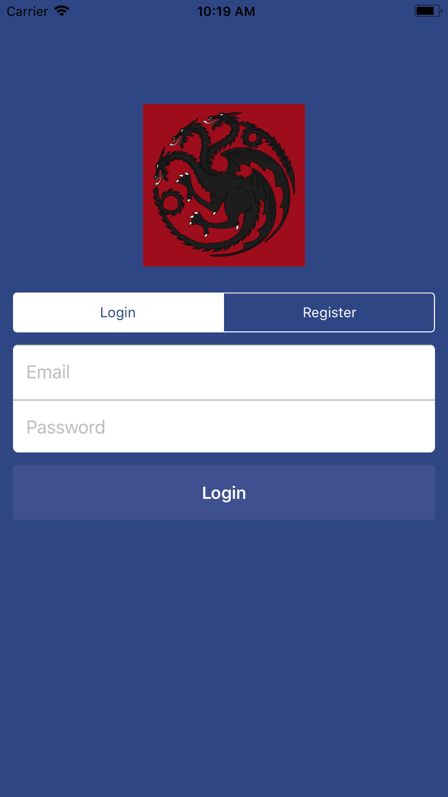
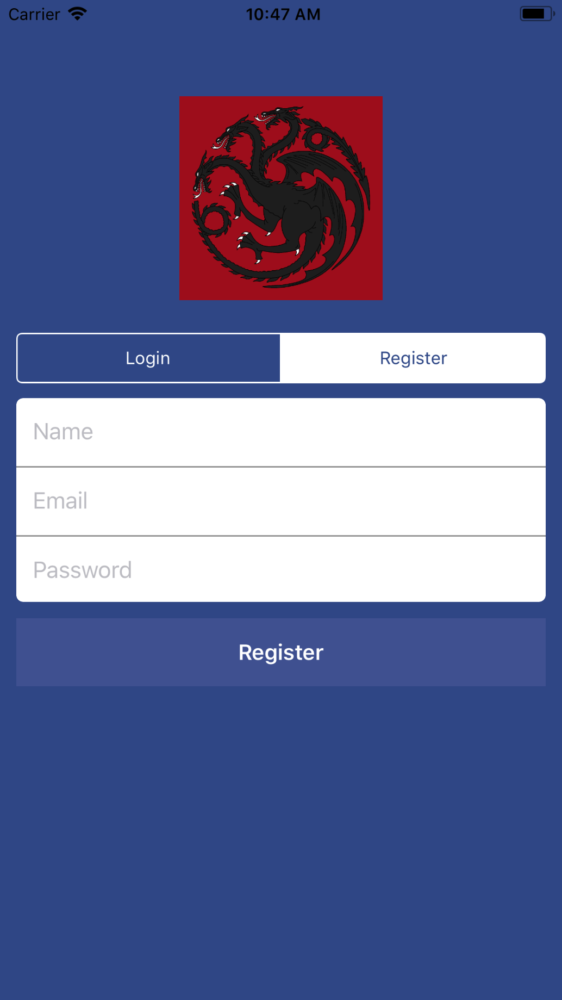
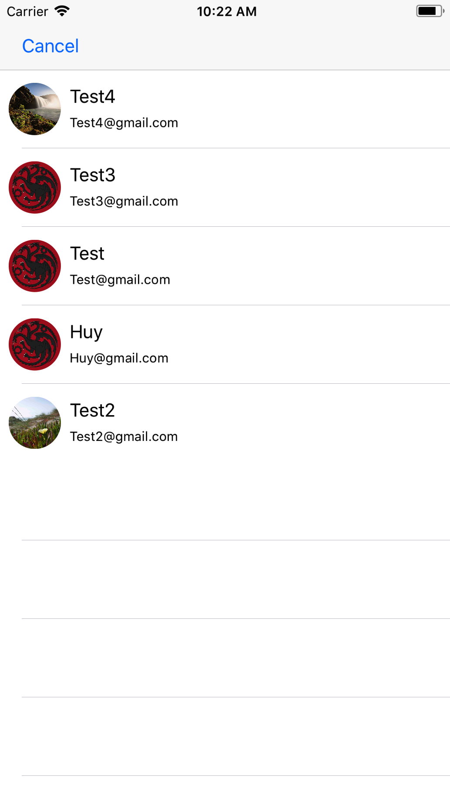
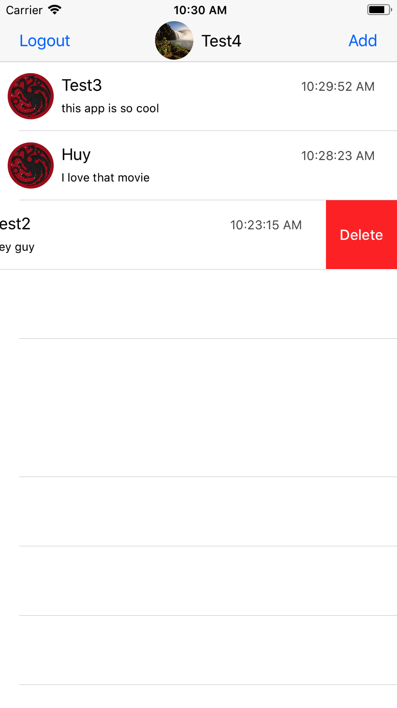
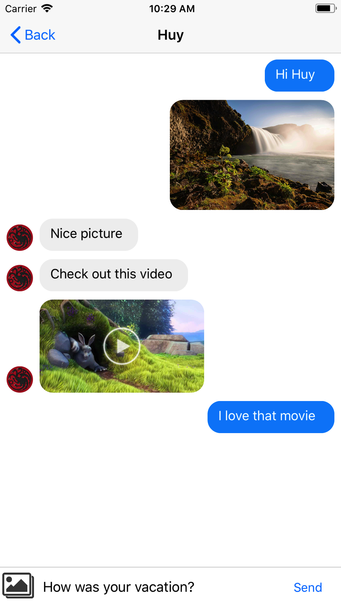

# RealTime-Chat

## Features
:white_check_mark: Swift  
:white_check_mark: MVC architecture  
:white_check_mark: Authentication (Firebase Authentication)  
:white_check_mark: Share pictures (Firebase Storage)  
:white_check_mark: Share videos (Firebase Storage)  
:white_check_mark: Realtime chat (Firebase Database) 
:white_check_mark: Delete messages  
:white_check_mark: UI Programatically (No Storyboard)  

## Screens
| Login    | Register   | New Message    | 
| :-------------: | :-------------: | :-------------: | 
|  |  |  |

|  Message List    | Chat Log    | Preview Picture    | 
| :-------------: | :-------------: | :-------------: |
|  |  |  |

